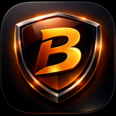

# 🌊 Brahman Browser

  

  <strong>A modern, privacy-focused Android browser by Brahman Labs</strong>

  
  
  
  
  
  

---

## ✨ Features

- 🌊 **Water UI** — Beautiful glassmorphism dark ocean theme
- 📑 **Multi-tab** — Open and manage multiple tabs
- 🔒 **HTTPS indicator** — Visual lock icon for secure sites
- 🕵️ **Incognito mode** — Private browsing
- 🖥️ **Desktop mode** — Full desktop user agent
- 🏠 **Home button** — Quick return to homepage
- 🔄 **Pull to refresh** — Swipe down to reload
- ⚡ **Fast & lightweight** — Built on Android WebView

---

## 🛠️ Tech Stack

| Component | Technology |
|---|---|
| Language | Kotlin 2.0.21 |
| Min SDK | Android 7.0 (API 24) |
| Target SDK | Android 14 (API 34) |
| Build System | Gradle 8.9 + AGP 8.7.0 |
| UI | Custom Water/Glassmorphism |
| Architecture | Single Activity |

---

## 🏗️ Project Structure
brahman-browser-android/
├── app/src/main/
│   ├── java/com/brahmanlabs/browser/
│   │   ├── MainActivity.kt      # Main browser activity
│   │   ├── BrowserAdapter.kt    # Tab RecyclerView adapter
│   │   ├── BrowserTab.kt        # Tab data model
│   │   └── TabManager.kt        # Tab management logic
│   └── res/
│       ├── layout/              # UI layouts
│       ├── drawable/            # Icons & backgrounds
│       └── values/              # Colors, themes, strings
---

## 🚀 Roadmap

- [x] Phase 1 — Foundation & Water UI
- [ ] Phase 2 — Bookmarks & History
- [ ] Phase 3 — Ad blocker & Privacy
- [ ] Phase 4 — Settings & Customization
- [ ] Phase 5 — Brahman Exclusive Features
- [ ] Phase 6 — Play Store Launch

---

## 🏢 About

**Brahman Browser** is developed by **Brahman Labs** with the vision of building a world-class, privacy-first browser that competes with Chrome and Brave.

---

## 📄 License

Copyright © 2026 Brahman Labs. All rights reserved.
